## Microsoft 365 Identity, Authentication, and Email Administration Lab

## Project Overview

This project demonstrates the administration and security configuration of a Microsoft 365 tenant using Microsoft Entra ID (Azure AD), Microsoft Authenticator, Outlook Online, and Self-Service Password Reset (SSPR).

The objective of this lab was to gain hands-on experience with Microsoft 365 user management, identity security, password recovery, Multi-Factor Authentication (MFA), role-based access control (RBAC), and Exchange Online email communication.

## Lab Environment

## Platform

Microsoft 365 Admin Center

Microsoft Entra Admin Center

Outlook Online (OWA)

Microsoft Authenticator

## Test Accounts

RaviKumar (Global Administrator)

user1 (Test User)

user2 (Global Reader)

## 1. User Administration and Licensing

Created Microsoft 365 cloud user accounts and assigned Microsoft 365 Business Standard licenses.

## Tasks Performed

Created user1 and user2

Assigned Microsoft 365 licenses

Verified successful account provisioning

Tested user sign-in

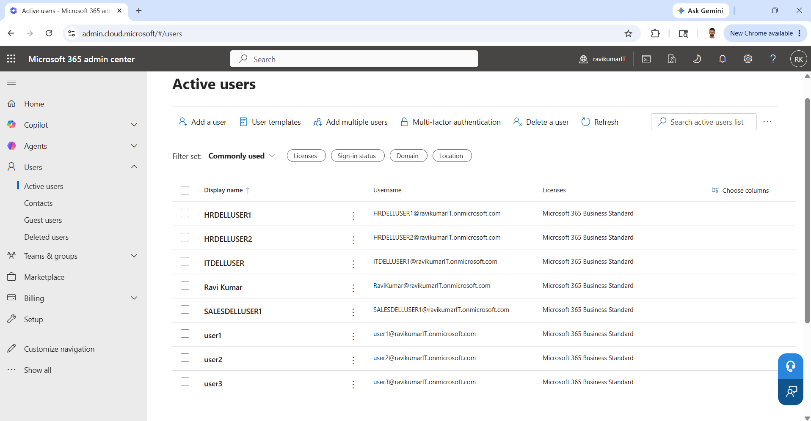

## 2. Role-Based Access Control (RBAC)

Configured administrative roles to implement least-privilege access.

Roles Assigned

RaviKumar → Global Administrator

user2 → Global Reader

Validated that user2 could view Microsoft 365 resources but could not make administrative changes.

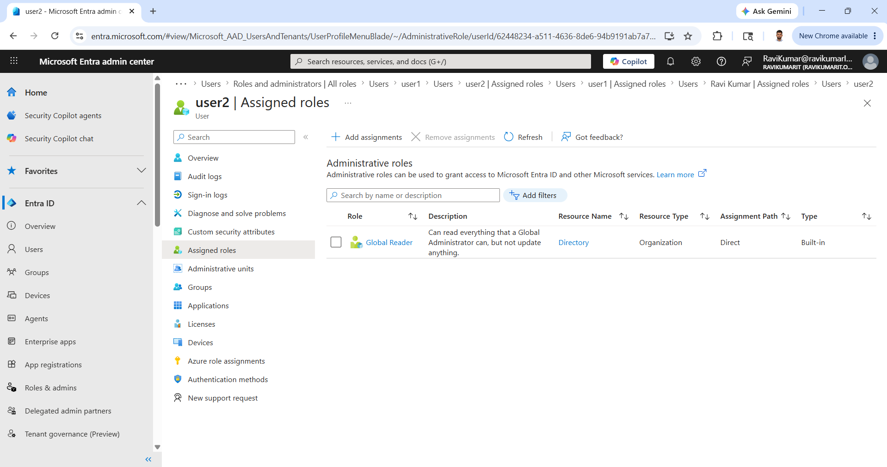

## 3. Self-Service Password Reset (SSPR)

Configured Self-Service Password Reset for selected users through Microsoft Entra ID.

## Configuration

Password Reset Enabled = Selected

Group Assigned = SSPR-Test-Users

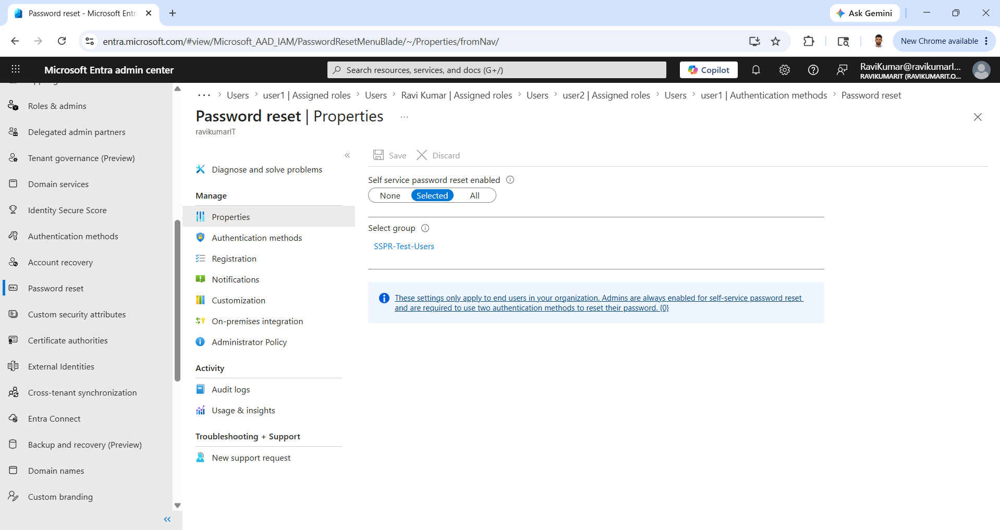

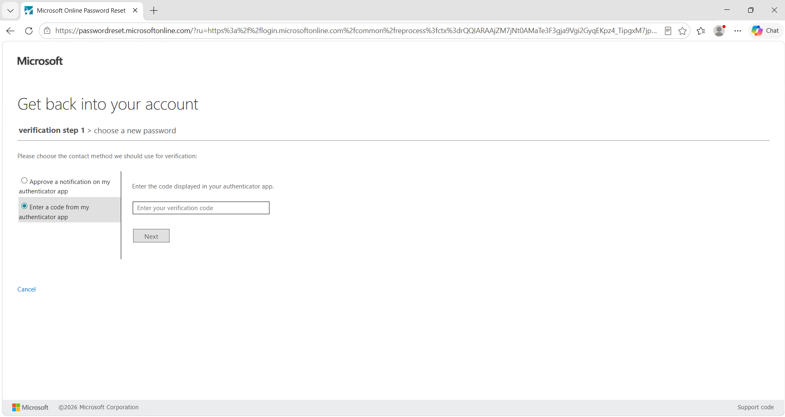

## 4. Authentication Methods Configuration

Configured password recovery authentication methods.

## Settings

Methods Required = 1

Security Questions Enabled

Questions Required For Registration = 5

Questions Required For Reset = 3

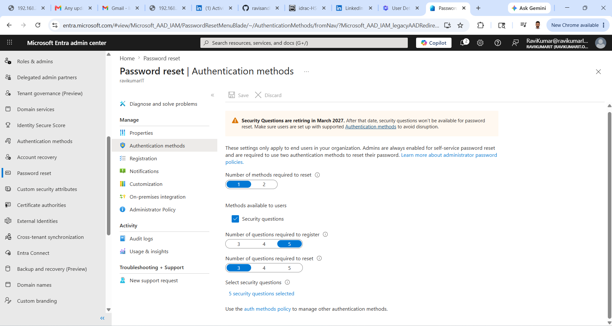

## 5. Registration Policy

Configured mandatory registration for password recovery.

## Settings

Require Users To Register = Yes

Reconfirmation Period = 180 Days

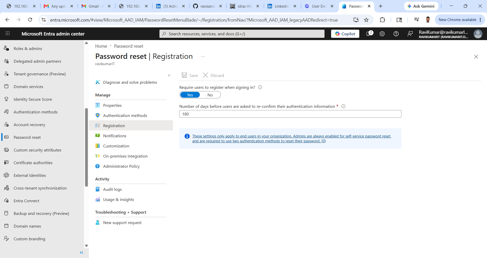

## 6. SSPR Group Configuration

Created a dedicated security group for SSPR users.

## Group - SSPR-Test-Users

## Members
user1
user2

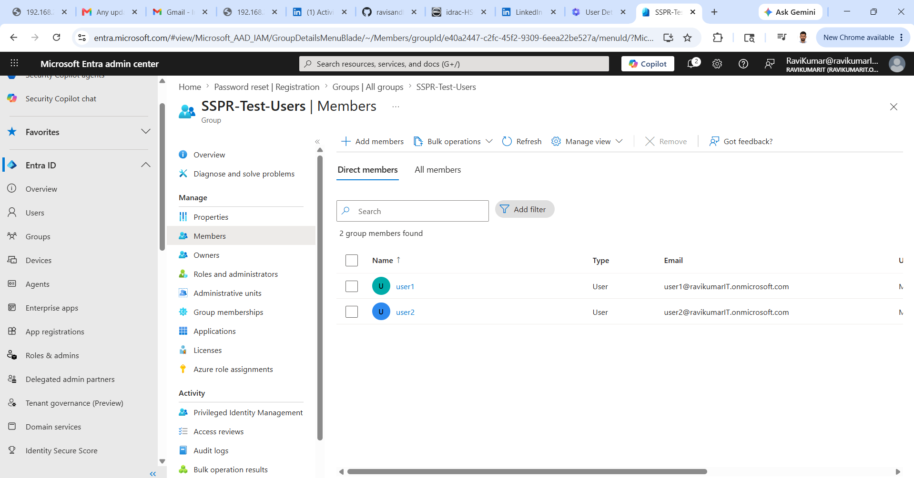

## 7. Microsoft Authenticator and MFA

Registered Microsoft Authenticator and configured Multi-Factor Authentication.

## Validation

Authenticator registration completed

Verification code tested

MFA challenge successfully completed

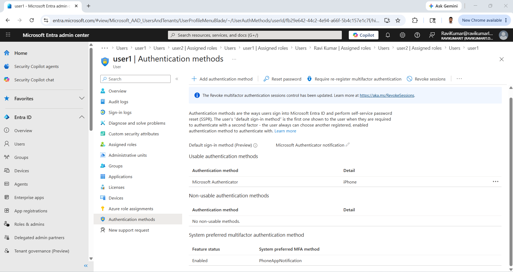

## 8. Exchange Online Email Communication Testing

Validated Outlook Online mailbox functionality and internal email communication.

## Tests Performed

User1 → User2

Email sent successfully

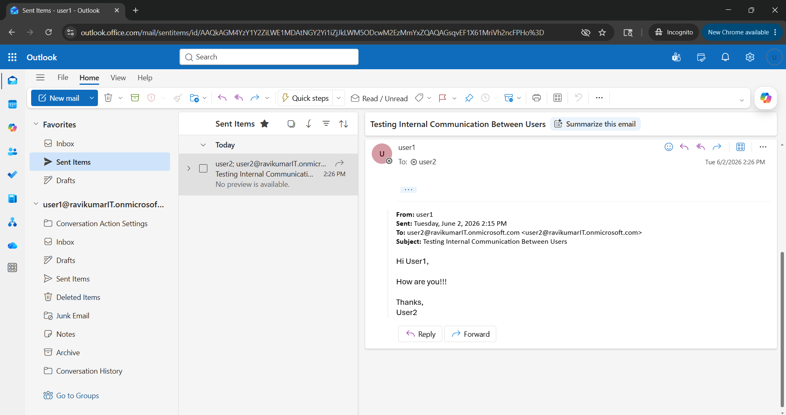

User2

Email received successfully

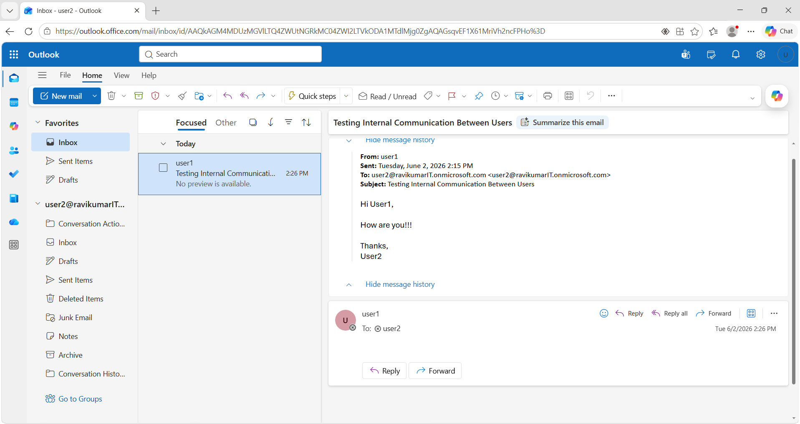

User2 → User1

Reply sent successfully

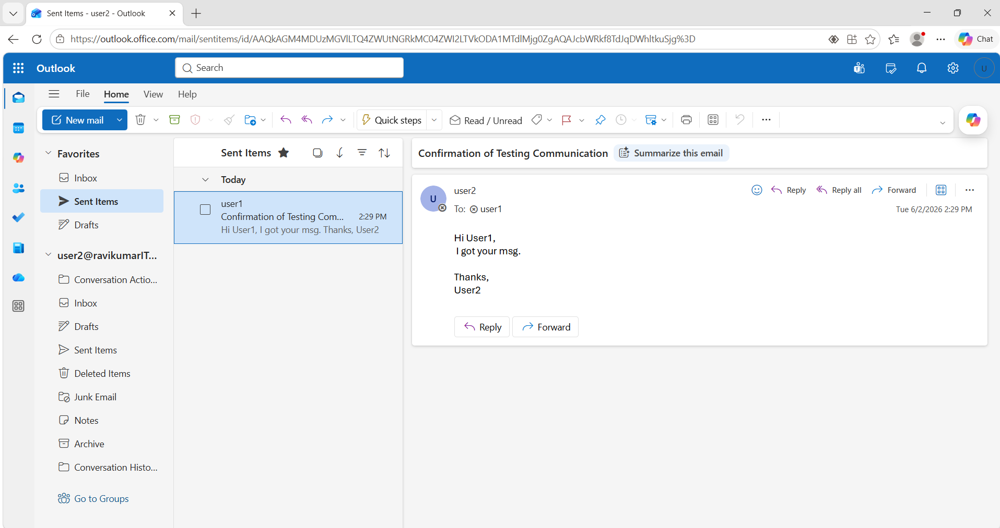

User1

Reply received successfully

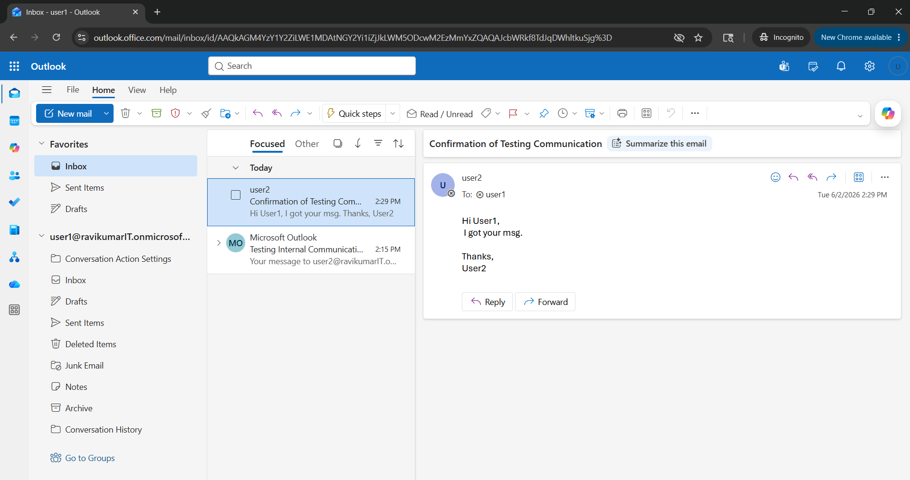

## Skills Demonstrated
- Microsoft 365 Administration
- Microsoft Entra ID (Azure AD)
- User and License Management
- Role-Based Access Control (RBAC)
- Multi-Factor Authentication (MFA)
- Microsoft Authenticator
- Self-Service Password Reset (SSPR)
- Security Group Administration
- Exchange Online
- Outlook Online Administration
- Identity and Access Management (IAM)
- Cloud Security Administration

## Author

## Ravi Kumar
